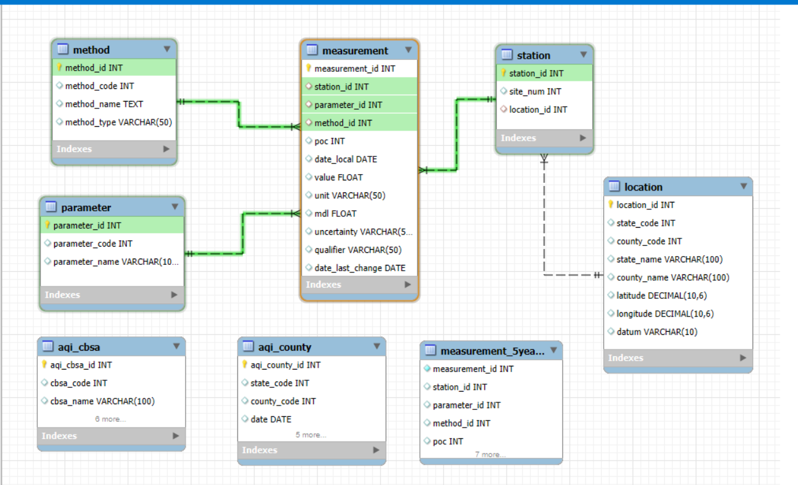

# **🗽🌬️📊 Air-Quality-USA-Analysis**

---

## **📦 Estructura del proyecto**

```sql
Air-Quality-USA-Analysis/
├── notebooks/                  # Jupyter notebooks
│   └── Proyecto Integrador Unicorn.ipynb
├── sql/                        # Scripts SQL
│   └── insert_xxx.sql
├── exportados/                 # Gráficos e informes (ya los tenés)
├── data/                       # CSV con datos limpios
│   └── tendencia_anual_CO.csv
├── utils/
│   └── db_connection.py        # Script de conexión a la DB
├── erd/
│   └── ERD Air Quality USA.mwb
├── README.md
├── requirements.txt
└── .gitignore
```
---

## 📐 Diagrama ER del Data Mart



---

## 🌐 Recursos

## 🌐 Recursos

- 📂 [**Descargar tabla** `measurement` (SQL, Google Drive)](https://drive.google.com/uc?id=1f5AbJXAao2tyihk8RpGkH7jJ57XMzCIR&export=download)
- 🌎 [Datos de calidad del aire de la EPA](https://www.epa.gov/outdoor-air-quality-data)
- 📖 [Guía de AQI](https://www.airnow.gov/aqi/aqi-basics/)
- 🗂️ [Datos históricos de calidad del aire en EE.UU.](https://aqs.epa.gov/aqsweb/airdata/download_files.html)
- 📊 [Documentación de Seaborn](https://seaborn.pydata.org/)

---

## 📊 Visualizaciones incluidas

### 🗺️ Mapas
- [Mapa de concentración por estado (2024)](exportados/mapa_concentracion_estados_2024.png)

### 🌦️ Estacionalidad y series
- [Comparativa estacional – California](exportados/comparativa_estacional_california.png)
- [Comparativa estacional – New York](exportados/comparativa_estacional_new%20york.png)
- [Estacionalidad CO](exportados/estacional_carbon_monoxide.png)
- [Estacionalidad NO₂](exportados/estacional_nitrogen_dioxide_(no2).png)
- [Estacionalidad O₃](exportados/estacional_ozone.png)
- [Estacionalidad SO₂](exportados/estacional_sulfur_dioxide.png)
- [Comparativa invierno vs verano (CSV)](exportados/comparativa_invierno_verano.csv)

### 📈 Tendencias anuales
- [Tendencia anual CO](exportados/tendencia_anual_CO.png)
- [Tendencia anual NO₂](exportados/tendencia_anual_NO2.png)
- [Tendencia anual O₃](exportados/tendencia_anual_O3.png)
- [Tendencia anual SO₂](exportados/tendencia_anual_SO2.png)
- [Tendencia anual – Estado de California](exportados/tendencia_anual_edo_calif.png)

### 🧭 Rankings (Top N)
- **Top 10 estados por promedio (2024):**  
  [CO](exportados/Top%2010%20Estados%20con%20Mayor%20Promedio%20de%20CO%20en%202024.png) ·
  [NO₂](exportados/Top%2010%20Estados%20con%20Mayor%20Promedio%20de%20NO2%20en%202024.png) ·
  [O₃](exportados/Top%2010%20Estados%20con%20Mayor%20Promedio%20de%20O3%20en%202024.png) ·
  [SO₂](exportados/Top%2010%20Estados%20con%20Mayor%20Promedio%20de%20SO2%20en%202024.png)
- **Top 5 condados por concentración (2018):**  
  [CO](exportados/Top%205%20Condados%20 con%20Mayor%20Concentraci%C3%B3n%20Promedio%20de%20CO%20en%202018.png) ·
  [NO₂](exportados/Top%205%20Condados%20con%20Mayor%20Concentraci%C3%B3n%20NO2%20en%202018.png) ·
  [O₃](exportados/Top%205%20Condados%20con%20Mayor%20Concentraci%C3%B3n%20O3%20en%202018.png) ·
  [SO₂](exportados/Top%205%20Condados%20con%20Mayor%20Concentraci%C3%B3n%20SO2%20en%202018.png)

### 🔎 Comparativas y otros
- [Heatmap de contaminantes (2024)](exportados/heatmap_contaminantes_2024.png)

---
